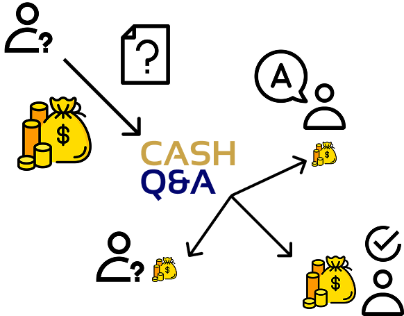
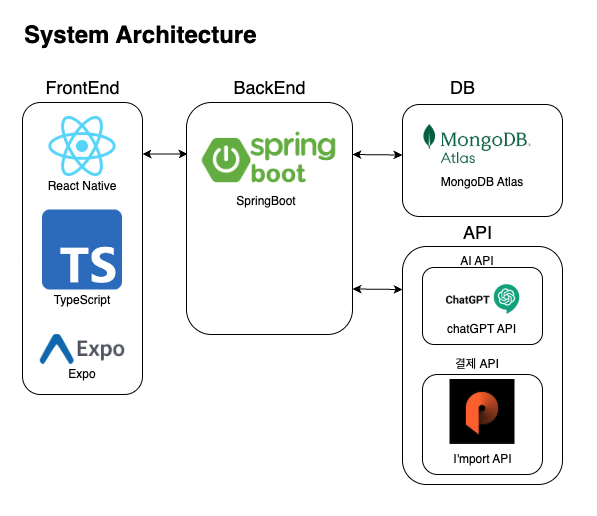

<!-- CASHQ&A README.md -->

<h1 align="center" style="color:#c9a348;">📱 CASHQ&A</h1>

현금 보상 기반 지식 공유 모바일 플랫폼

---

## 프로젝트 소개

> **CASHQ&A**는 사용자들이 질문을 올리고, 그에 대한 답변을 통해 보상을 주고받을 수 있는 **현금 보상형 Q&A 모바일 앱**입니다.

---

## 주요 기능

- 💬 **질문 올리기**
- 🎯 **현상금 제도**
- 🧠 **나와 알맞는 질문 찾기**
- 👤 **용돈 벌기**

---

## 비즈니스 모델

> 광고 수익 + 수수료 기반의 수익 모델

---

## 시스템 아키텍쳐

> 모바일 클라이언트와 서버, 외부 API 간의 통신 구조

---

## 기대효과

1. 전문가급 답변 생태계 조성: CASH Q&A는 금전적 보상을 통해 다수의 전문가 유입을 기대하고, 이를 통해 양질의 믿을 만한 정보의 공유를 바라보고 있습니다.

2. AI의 한계를 보완하는 인간 중심 Q&A 플랫폼 조성: CASHQ&A는 인간의 AI 의존증을 낮추어 중요한 상황에서 신뢰할 수 있는 전문가의 의견을 원활하게 받을 수 있도록 돕고자 합니다.

- ✔️ 사용자 간 **유익한 지식 공유 활성화**
- ✔️ 청년층을 위한 **현금 보상형 참여 유도**
- ✔️ 기업 대상의 **타겟 광고 및 설문 수익화**
- ✔️ 커뮤니티 성장에 따른 **데이터 기반 가치 창출**

---

© 2025 CASHQ&A Team

